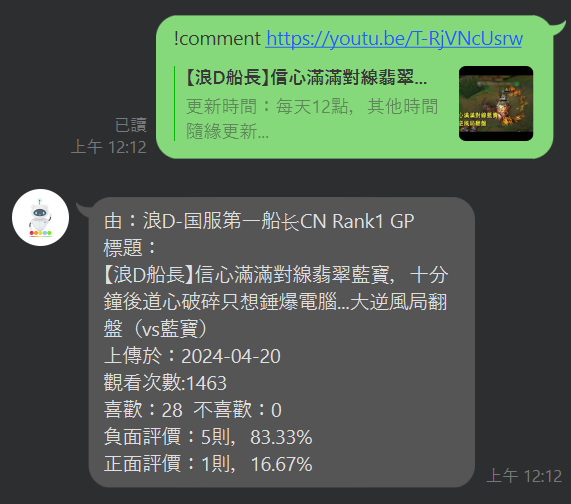

# MoodBot
###### tags: `自主學習`, `人工智慧`, `聊天機器人`
一個判斷YouTube影片留言的 LINE Bot 
## Environment Variable
+ SECRET：LINE channel Secret
+ TOKEN：LINE channel access token
+ KEY：Google Cloud API key

## Packages
```
python = "3.10"
requests = "2.31.0"
flask = "3.0.3"
jieba = "0.42.1"
line-bot-sdk = "3.11.0"
numpy = "1.26.4"
pandas = "2.2.2"
joblib = "1.4.0"
scikit-learn = "1.2.2"
```
## Exhibit


