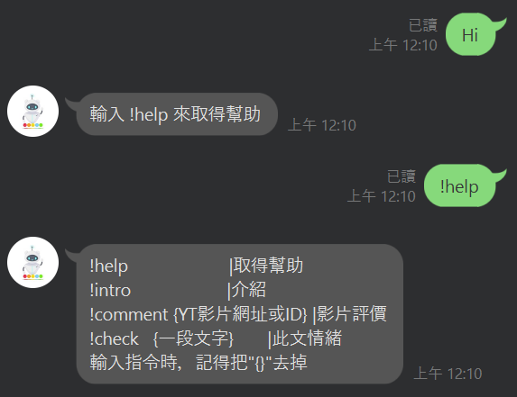

# MoodBot

一個LINE機器人，為高中二年級的自主學習計畫製作。


2024年升級linebot至v3，也將回應訊息改為Flex Message美化。

## Features

+ 判斷文字情緒
+ 統計YouTube影片的留言評價

## Screenshots

Original



New


## Tech Stack

Bot: [pallets/flask](https://github.com/pallets/flask), [line/line-bot-sdk-python](https://github.com/line/line-bot-sdk-python)

AI: [fxsjy/jieba](https://github.com/fxsjy/jieba), [scikit-learn/scikit-learn](https://github.com/scikit-learn/scikit-learn)

Crawler: [psf/requests](https://github.com/psf/requests), [YouTube Data API v3](https://console.cloud.google.com/apis/api/youtube.googleapis.com/)

## Environment Variables

To run this project, you will need to add the following environment variables

```
KEY="Google Cloud API key for YouTube API"
TOKEN="Channel access token for LINE Messaging API"
SECRET="Channel secret for LINE Messaging API"
```

## Requirements(Tested)

Python: 3.10

```
flask==3.0.3
jieba==0.42.1
joblib==1.4.0
line-bot-sdk==3.11.0
numpy==1.26.4
pandas==2.2.2
requests==2.31.0
scikit-learn==1.2.2
```

#### v3

Python: 3.12.1

```
flask==3.0.3
jieba==0.42.1
joblib==1.4.2
line-bot-sdk==3.11.0
numpy==2.0.1
requests==2.31.0
scikit-learn==1.5.1
```

