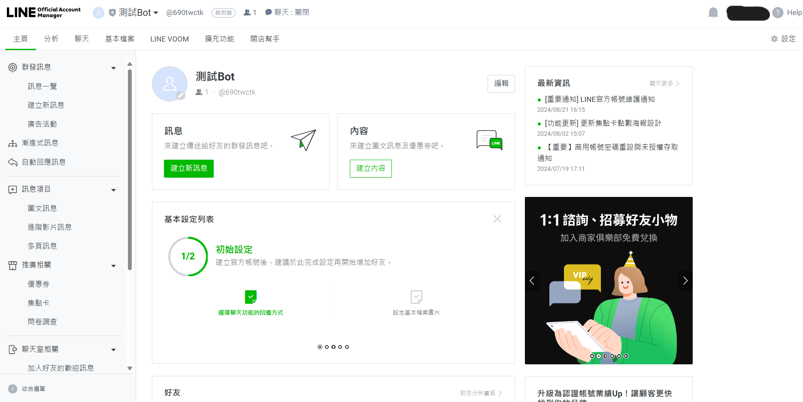
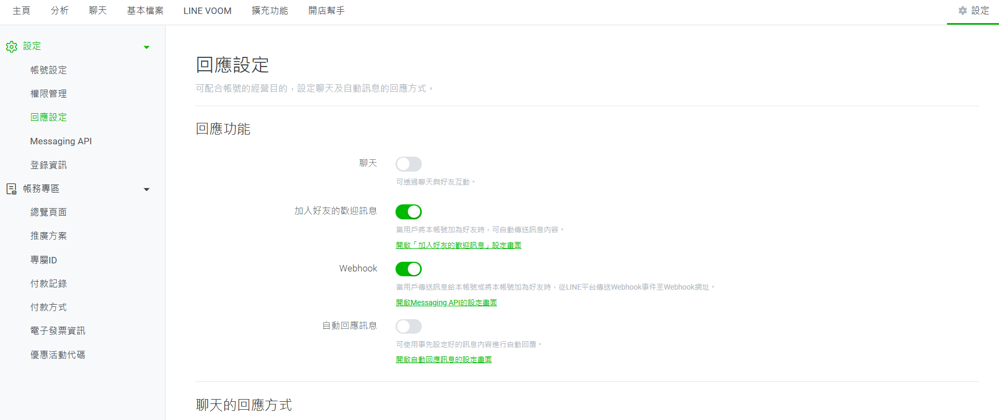
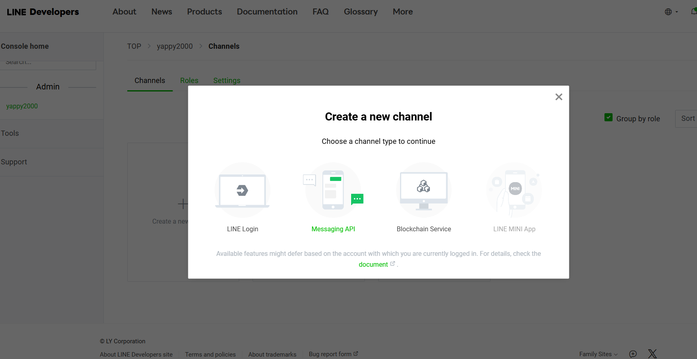
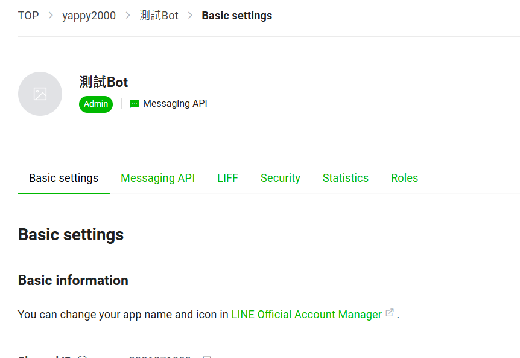

# 前置準備
> [!IMPORTANT]
> 在開始之前，你需要一個LINE帳號。可以前往[LINE 官網](https://line.me/)並透過他們的APP申請一個帳號。

## 官方帳號
我們得先為我們的機器人申請一個官方帳號。

首先登入[LINE官方帳號管理頁面](https://manager.line.biz/)，並建立一個新的帳號。

填寫相關資料後，可以進到這個畫面。

進入設定 > 回應設定。  
開啟Webhook並關閉自動回應訊息。

## Messaging API
登入[LINE Developers](https://developers.line.biz/console/)，建立一個Provider。

接著建立一個Messaging API

建立完成後的畫面長這樣

請找到並保存好以下這兩個字串。我們之後會用到它們：
1. 在Basic settings頁面的Channel secret
2. 在Messaging API頁面的Channel access token

> [!TIP]
> 如果沒有看到，可以按Issue按鈕來生成。

## Webhook
為了獲取Webhook URL，建議註冊一個[ngrok](https://ngrok.com/)帳號來方便開發。

---

恭喜，現在一切已準備就緒，我們馬上來設計自己的機器人吧！
